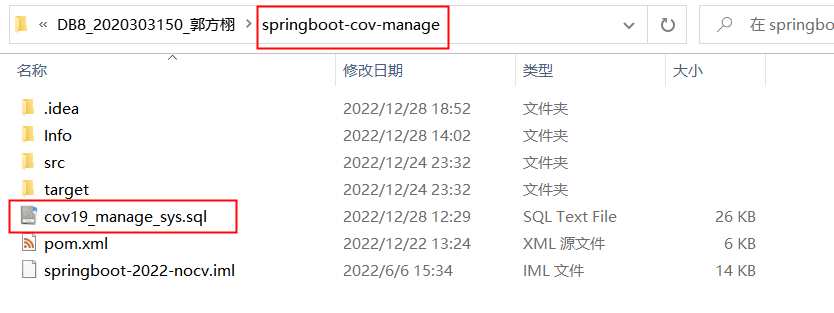

## 运行文档

### 环境安装：

- JDK1.8
- Mysql8.0.30
- Mysql数据库驱动jar包
- Idea2022任意版本

### 运行步骤：

#### 运行SQL语句，创建数据库：

通过Mysql Workbench或Navicat等软件运行springboot-cov-manage文件夹下cov19_manage_sys.sql脚本，创建数据库并导入数据。

#### 打开idea工程：

在springboot-cov-manage文件夹上右键，选择open folder as intellij idea project  

  选择信任项目：

  之后从文件->设置中对Maven进行配置：

#### 刷新Maven依赖：

在右侧找到Maven栏，点击刷新按钮，之后等待Maven依赖刷新完成(可从下方的加载信息判断)：

#### 修改application.yml配置文件，连接数据库：

修改src/main/resources/application.yml，如下：

#### 运行服务端：

#### 打开chrome或edge浏览器，进行访问：

#### 进入登录界面：

执行SQL脚本后数据库中的数据如下：

 

每一用户均可进行登录，不过由于SQL脚本中只给admin用户赋予了完整的菜单栏权限，其他用户只能看到部分菜单栏，所以建议开始时使用admin用户进行登录，之后在用户管理和角色管理页面为其他用户和角色分配菜单栏权限，再用其他用户登录。

**之后的运行过程详见演示视频**

  

  

