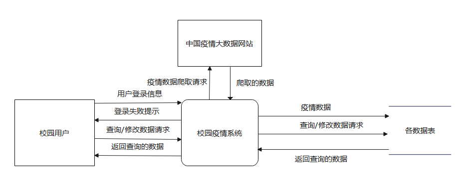

# 基于Springboot+Mybatis-Plus+Mysql实现的校园疫情系统

## 需求分析

自从新冠疫情爆发以来，防疫管理变成了高校行政管理的重中之重，好的管理离不开高效的系统，所以开发一款校园疫情防控系统实属必要。防疫背景下，师生的健康打卡、核酸检测成为常态，应对这些记录进行有效管理与保存，且随着新型疫苗的研发与推广接种，有必要统计校内人员的疫苗接种情况，以便对未进行疫苗接种的人员进行及时沟通。此外，在政策放开的大背景下，相关细化政策会不断出台，有必要收集最新的政策新闻进行播报，并展示国内疫情的基本形势。今后围绕新冠的统计数据类型、校内防控措施也会趋向多元化，系统必须具有良好的可扩展性，并有必要基于多种角色权限实现系统的分域管理。用户在进入系统时，应进行登录信息的验证，之后根据用户的级别构建用户的系统视图。

### 数据流图

#### 顶层图：



#### 0层图：


#### 1层图：

##### P1:


##### P2：


##### P3：


##### P4：


##### （P5-P8已分解的较为彻底，无1层图）

#### 2层图：

除请假审批管理外，其他管理过程皆和核酸检测管理形式一致，如下为P4.2核酸检测管理的2层图：


请假审批管理的2层图如下：


### 数据字典

#### 数据项字典

|<span style="display:inline-block;width:100px">数据项名</span>|说明|<span style="display:inline-block;width:80px">类型</span>|<span style="display:inline-block;width:70px">长度</span>|
| :------------- | :----------------------------------------------------------- | :--------- | :------ |
|验证码|用户登录时输入的信息项，用于身份验证|字符型|4|
|登录失败的提示字串|用户登录失败后的提示信息|字符型|最大20|
|     用户ID     | 用户表中用户的索引标识，具有唯一性                           |    整型    |    4    |
| 用户校园身份号 | 校园用户的标识，具有唯一性                                   | 可变字符型 | 最大50  |
|     用户名     | 校园用户的称呼                                               | 可变字符型 | 最大255 |
|    身份证号    | 用户的公民身份证                                             |   字符型   | 最大50  |
|    用户密码    | 用户的登录密码，默认为"123456"                               | 可变字符型 | 最大50  |
|    用户性别    | 人的性别                                                     | 可变字符型 |  最大4  |
|    用户年龄    | 人的年龄                                                     |    整型    |    4    |
|    用户地址    | 用户的住址                                                   | 可变字符型 | 最大255 |
|    用户头像    | 用户在系统中的头像，为路径形式                               | 可变字符型 | 最大255 |
|   用户手机号   | 用户的手机号                                                 | 可变字符型 | 最大15  |
|     学院ID     | 学院表中学院的索引标识，具有唯一性                           |    整型    |    4    |
|     学院名     | 学院的叫法                                                   | 可变字符型 | 最大255 |
|     角色ID     | 角色表中角色的索引标识，具有唯一性                           |    整型    |    4    |
|     角色名     | 角色的叫法，不同角色可以被赋予不同权限                       | 可变字符型 | 最大255 |
|    角色备注    | 对角色职能的说明                                             | 可变字符型 | 最大255 |
|    角色级别    | 不同级别的角色具有不同的审批权等权利，固定分为"学生级"、"教师级"、"院级"、"管理员级"四种级别 | 可变字符型 | 最大255 |
|    菜单栏ID    | 菜单栏表中菜单栏的索引标识，具有唯一性                       |    整型    |    4    |
|  父级菜单栏ID  | 用于构建菜单栏树                                             |    整型    |    4    |
|   菜单栏标题   | 在网页中见到的菜单栏名字                                     | 可变字符型 | 最大255 |
|   菜单栏图标   | 菜单栏的显示图标，为路径形式                                 | 可变字符型 | 最大255 |
| 菜单栏跳转路径 | 菜单栏的入口URL                                              | 可变字符型 | 最大255 |
| 菜单栏展开标记 | 标识菜单栏默认状态下是否展开呈现(如果有子菜单栏，就会将子菜单栏也显示出来)，可否进行展开，值为0代表默认不展开，值为1代表默认展开 |    整型    |    4    |
|     菜单栏可用标记     | 标识菜单栏当前是否可用，值为0代表不可用，值为1代表可用 | 整型 | 4 |
|     中国疫情数据更新时间     | 中国疫情数据更新的时间        | 时间型 | 8 |
|     中国累计确诊病例     | 截止更新时间，中国累计确诊的病例数 | 整型 | 4 |
|     中国累计输入病例     | 截止更新时间，中国累计输入的病例数 | 整型 | 4 |
|     中国累计治愈病例     | 截止更新时间，中国累计治愈的病例数  | 整型 | 4 |
|     中国累计死亡病例     | 截止更新时间，中国累计死亡的病例数  | 整型 | 4 |
| 省份名 | 省份的称谓 | 可变字符型 | 最大255 |
| 城市名 | 城市的称谓 | 可变字符型 | 最大255 |
| 县乡名 | 县乡的称谓 | 可变字符型 | 最大255 |
|     各省现有确诊病例     | 截止更新时间，各省的确诊病例数   | 整型 | 4 |
| 高风险地区 | 对某区域查询到的所含高风险地区 | 可变字符型 | 任意 |
| 高风险小区 | 对某区域查询到的所含高风险小区 | 可变字符型 | 任意 |
| 截止时间 | 风险地区统计的截止时间 | 可变字符型 | 任意 |
|     疫情新闻标题     | 疫情新闻的标题                | 可变字符型 | 最大255 |
|     疫情新闻内容     | 疫情新闻的内容             | 可变字符型 | 最大255 |
|     疫情新闻发布者     | 疫情新闻的发布者               | 可变字符型 | 最大255 |
|     疫情新闻创建时间     | 疫情新闻的创建时间              | 时间型 | 8 |
|     请假审批记录ID     | 请假审批记录表中请假审批记录的索引标识，具有唯一性 | 整型 | 4 |
|     请假用户ID     | 创建某请假申请的用户ID  | 整型 |                             4                             |
|     请假原因     | 请假的原因              | 可变字符型 | 最大255 |
|     请假的前往地     | 请假的前往地                 | 可变字符型 | 最大255 |
|     请假天数     | 请假的天数                  | 整型 | 4 |
|     请假申请的审批状态     | 整型标识的审批状态：1代表老师正在审核中状态，2代表老师驳回状态，3代表院系正在审核中状态，4代表院系驳回状态，5代表审核通过状态 | 整型 | 4 |
|     请假申请的提交时间     | 请假申请的提交时间        | 时间型 | 8 |
|     请假申请的审批时间     | 每次审批都会更新审批时间     | 时间型 | 8 |
|     核酸检测记录ID     | 核酸检测记录表中核酸检测记录的索引标识，具有唯一性 | 整型 | 4 |
| 核酸检测的用户ID | 创建某核酸检测记录的用户ID | 整型 | 4 |
|     核酸检测类型     | 检测类型，目前可固定分为单检和混检两类 | 可变字符型 | 最大255 |
|     核酸检测的检测时间     | 做核酸的时间  | 时间型 | 8 |
|     核酸检测的出结果时间     | 出结果的时间 | 时间型 | 8 |
|     健康打卡记录ID     | 健康打卡记录表中健康打卡记录的索引标识，具有唯一性 | 整型 | 4 |
| 健康打卡的用户ID | 创建某健康打卡记录的用户ID | 整型 | 4 |
|     打卡用户的早上体温     | 打卡用户的早上体温，用字符串存储 | 可变字符型 | 最大255 |
|     打卡用户的中午体温     | 打卡用户的中午体温，用字符串存储 | 可变字符型 | 最大255 |
|     打卡用户的晚上体温     | 打卡用户的晚上体温，用字符串存储 | 可变字符型 | 最大255 |
|     打卡用户的近期经过地区     | 打卡用户的晚上体温，用字符串存储 | 可变字符型 | 最大255 |
|     打卡用户的近期经过地区的风险地区     | 打卡用户的近期经过地区的风险地区 | 可变字符型 | 最大255 |
|     打卡用户的健康状况     | 打卡用户的健康状况 | 可变字符型 | 最大255 |
|     打卡记录的创建和更新时间     | 打卡记录的创建和更新时间，打卡记录创建和每次更新都会更新该时间 | 时间型 | 8 |
|     疫苗接种记录ID     | 疫苗接种记录表中疫苗接种记录的索引标识，具有唯一性 | 整型 | 4 |
| 疫苗接种的用户ID | 创建某疫苗接种记录的用户ID | 整型 | 4 |
|     接种针次     | 接种针次 | 可变字符型 | 最大255 |
|     接种批次     | 接种批次 | 可变字符型 | 最大255 |
|     疫苗厂家     | 疫苗厂家 | 可变字符型 | 最大255 |
|     负责接种的单位     | 负责接种的单位 | 可变字符型 | 最大255 |
| 爬取的HTTP请求 | 爬取网站数据时要发送的HTTP请求 | 可变字符型 | 任意 |
|     网站上爬取的中国疫情数据     | 网站上爬取的中国疫情数据 | 可变字符型 | 任意 |


#### 数据结构字典

| <span style="display:inline-block;width:100px">数据结构</span> | <span style="display:inline-block;width:200px">含义</span> | 组成成分                                                     |
| ------------------------------------------------------------ | ---------------------------------------------------------- | ------------------------------------------------------------ |
| 用户登录数据                                                 | 用户登录时输入的内容，包括用户的校园身份号、密码、验证码   | 用户的校园身份号、密码、验证码                               |
| 登录失败的提示信息                                           | 用户登录失败后的提示信息                                   | 登录失败的提示字串                                           |
| 用户信息记录                                                 | 用户各类信息特征的集合                                     | 用户ID、用户校园身份号、用户名、身份证号、用户密码、用户性别、用户年龄、用户地址、用户头像、用户手机号 |
| 学院信息记录                                                 | 学院各类信息特征的集合                                     | 学院ID、学院名                                               |
| 角色信息记录                                                 | 角色各类信息特征的集合                                     | 角色ID、角色名、角色备注、角色级别                           |
| 菜单栏信息记录                                               | 菜单各类信息特征的集合                                     | 菜单栏ID、父级菜单栏ID、菜单栏标题、菜单栏图标、菜单栏跳转路径、菜单栏展开标记、菜单栏可用标记 |
| 中国整体疫情数据                                             | 中国整体疫情数据各类信息特征的集合                         | 中国疫情数据更新时间、中国累计确诊病例、中国累计输入病例、中国累计治愈病例、中国累计死亡病例 |
| 各省现有确诊统计记录                                         | 建立了省份与该省现有确诊的对应关系                         | 省份名、中国疫情数据更新时间、各省现有确诊病例               |
| 待查地区关键字                                               | 查找某地区的风险地区的输入信息                             | 省份名、城市名、县乡名                                       |
| 地区风险信息项                                               | 对某区域查询到风险信息                                     | 高风险地区、高风险校区、截止时间                             |
| 疫情新闻记录                                                 | 疫情新闻各类特征的集合                                     | 疫情新闻标题、疫情新闻内容、疫情新闻发布者、疫情新闻创建时间 |
| 请假审批记录                                                 | 请假审批各类信息特征的集合                                 | 请假审批记录ID、请假用户ID、请假原因、请假的前往地、请假天数、请假申请的审批状态、请假申请的提交时间、请假申请的审批时间 |
| 核酸检测记录                                                 | 核酸检测各类信息特征的集合                                 | 核酸检测的检测时间核酸检测记录ID、核酸检测的用户ID、核酸检测类型、核酸检测的出结果时间 |
| 健康打卡记录                                                 | 健康打卡各类信息特征的集合                                 | 健康打卡记录ID、健康打卡的用户ID、打卡用户的早上体温、打卡用户的中午体温、打卡用户的晚上体温、打卡用户的近期经过地区、打卡用户的近期经过地区的风险地区 |
| 疫苗接种记录                                                 | 疫苗接种各类信息特征的集合                                 | 疫苗接种记录ID、疫苗接种的用户ID、接种针次、接种批次、疫苗厂家、负责接种的单位、接种时间 |
| 爬取的HTTP请求                                               | 爬取网站数据时要发送的HTTP请求                             | URI，HEADER，Body                                            |
| 网站上爬取的中国疫情数据                                     | 网站上爬取的中国疫情数据                                   | 为一可解析的字符串型数据结构                                 |


#### 数据流字典

| <span style="display:inline-block;width:90px">数据流名</span> | 说明                                                         | <span style="display:inline-block;width:55px">来源</span> | <span style="display:inline-block;width:60px">去向</span> | <span style="display:inline-block;width:80px">数据结构</span> |
| :------------------- | :----------------------------------------------------------- | :------------- | :------------- | :------------- |
| 用户登录信息         | 用户登录时输入的校园身份号和密码，用于验证身份               | 用户           | 用户信息表     | 用户登录数据   |
| 登录失败提示         | 如果身份未验证通过，会返回给用户登录失败提示                 | P1登录验证     | 用户           | 登录失败信息   |
| 用户信息             | P1登录验证过程中从用户信息表中查找得到的用户记录             | 用户信息表     | P1登录验证     | 用户信息记录   |
| 成功登录的用户信息   | 经过P1登录验证后登录成功的用户信息，之后会被P2角色视图构建过程用去查询角色表 | P1登录验证     | 角色表         | 用户信息记录   |
| 角色信息                  | P2角色视图构建过程中为了进行权限检查而对当前用户对应角色信息进行查询，之后会被用去查菜单栏表,或是被P4校园防疫管理过程用去做近一步权限限制 | 角色表         | 菜单栏表/P4校园防疫管理   | 角色信息记录       |
| 角色可见的菜单栏 | 经过P2角色视图构建过程的查询，菜单栏表返回的当前角色可见的菜单栏 | 菜单栏表 | P2角色视图构建 | 菜单栏信息记录 |
| 登录用户的学院ID | 用于P2角色视图构建过程对学院表的查询，获得当前用户所在的学院 | P2角色视图构建 | 学院表 | 学院ID |
| 查出的学院信息 | 查找到的当前用户所在的学院的记录 | 学院表 | P2角色视图构建 | 学院信息记录 |
| 用户数据筛选请求     | P2角色视图构建过程得到了当前用户下用户信息表的视图，发出对用户信息表的筛选请求 | P2角色视图构建 | 用户信息表     | 用户信息表记录 |
| 角色数据筛选请求     | P2角色视图构建过程得到了当前用户下角色表的视图，发出对角色表的筛选请求 | P2角色视图构建 | 角色表         | 角色信息记录   |
| 菜单栏数据筛选请求   | P2角色视图构建过程得到了当前用户下菜单栏表的视图，发出对菜单栏表的筛选请求 | P2角色视图构建 | 菜单栏表       | 菜单栏信息记录 |
| 学院数据筛选请求     | P2角色视图构建过程得到了当前用户下学院表的视图，发出对学院表的筛选请求 | P2角色视图构建 | 学院表         | 学院信息记录   |
| 核酸检测记录筛选请求 | P2角色视图构建过程得到了当前用户下核酸检测记录表的视图，发出对核酸检测记录表的筛选请求 | P2角色视图构建 | 核酸检测记录表 | 核酸检测记录   |
| 健康打卡记录筛选请求 | P2角色视图构建过程得到了当前用户健康打卡记录表的视图，发出对健康打卡记录表的筛选请求 | P2角色视图构建 | 健康打卡记录表 | 健康打卡记录   |
| 请假审批记录筛选请求 | P2角色视图构建过程得到了当前用户请假审批记录表的视图，发出对请假审批记录表的筛选请求 | P2角色视图构建 | 请假审批记录表 | 请假审批记录   |
| 疫苗接种记录筛选请求 | P2角色视图构建过程得到了当前用户疫苗接种记录表的视图，发出对疫苗接种记录表的筛选请求 | P2角色视图构建 | 疫苗接种记录表 | 疫苗接种记录 |
| 疫情新闻数据筛选请求        | P2角色视图构建过程得到了当前用户疫情新闻表的视图，发出对疫情新闻表的筛选请求 | P2角色视图构建 | 疫情新闻表 | 疫情新闻记录 |
| 查询/修改数据请求         | 用户提出的查询或修改某类记录的请求                           | 用户           | P3系统管理/P4校园防疫管理 | 各类可管理表的记录 |
| 查询/修改用户记录请求     | 用户通过P3系统管理过程提出的查询或修改用户记录的请求         | 用户           | 用户信息表                | 用户信息记录       |
| 可见的用户记录 | 经过的P2角色视图构建过程对用户数据筛选以及用户通过P3系统管理过程的查询，得到的用户记录 | 用户信息表 | 用户 | 用户信息记录 |
| 查询/修改角色记录请求     | 用户通过P3系统管理过程提出的查询或修改角色记录的请求         | 用户           | 角色表                    | 角色信息记录       |
| 可见的角色记录 | 经过P2角色视图构建过程对角色数据筛选以及用户通过P3系统管理过程的查询，得到的角色记录 | 角色表 | 用户 | 角色信息记录 |
| 查询/修改菜单栏记录请求   | 用户通过P3系统管理过程提出的查询或修改菜单栏记录的请求       | 用户           | 菜单栏表                  | 菜单栏信息记录     |
| 可见的菜单栏记录 | 经过P2角色视图构建过程对单栏数据筛选以及用户通过P3系统管理过程的查询，得到的菜单栏记录 | 菜单栏信息表 | 用户 | 菜单栏信息记录 |
| 查询/修改学院记录请求     | 用户通过P3系统管理过程提出的查询或修改学院记录的请求         | 用户           | 学院表                    | 学院信息记录       |
| 可见的学院记录 | 经过P2角色视图构建过程对学院数据筛选以及用户通过P3系统管理过程的查询，得到的学院记录 | 学院信息表 | 用户 | 学院信息记录 |
| 查询/修改核酸检测记录请求 | 用户通过P4校园防疫管理过程提出的查询或修改核酸检测记录的请求   | 用户           | 核酸检测记录表            | 核酸检测记录       |
| 可见的核酸检测记录 | 经过的P2角色视图构建过程对核酸检测数据的筛选以及用户通过P4校园防疫管理过程的查询，得到的核酸检测记录 | 核酸检测记录表 | 用户 | 核酸检测记录 |
| 查询/修改健康打卡记录请求 | 用户通过P4校园防疫管理过程提出的查询或修改健康打卡记录的请求   | 用户           | 健康打卡记录表            | 健康打卡记录       |
| 可见的健康打卡记录 | 经过的P2角色视图构建过程对健康打卡数据筛选以及用户通过P4校园防疫管理过程的查询，得到的健康打卡记录 | 健康打卡记录表 | 用户 | 健康打卡记录 |
| 查询/修改请假审批记录请求 | 用户通过P4校园防疫管理过程提出的查询或修改请假审批记录的请求 | 用户           | 请假审批记录表            | 请假审批记录       |
| 可见的请假审批记录 | 经过的P2角色视图构建过程对请假审批数据筛选以及用户通过P4校园防疫管理过程的查询，得到的请假审批记录 | 请假审批记录表 | 用户 | 请假审批记录 |
| 查询/修改疫苗接种记录请求 | 用户通过P4校园防疫管理过程提出的查询或修改疫苗接种记录的请求 | 用户           | 疫苗接种记录表            | 疫苗接种记录     |
| 可见的疫苗接种记录 | 经过的P2角色视图构建过程对疫苗接种数据筛选以及用户通过P4校园防疫管理过程的查询，得到的疫苗接种记录 | 疫苗接种记录表 | 用户 | 疫苗接种记录 |
| 查询/修改疫情新闻记录请求 | 用户通过P4校园防疫管理过程提出的查询或修改疫情新闻记录的请求 | 用户           | 疫情新闻表                | 疫情新闻记录       |
| 可见的疫情新闻记录 | 经过的P2角色视图构建过程对疫情新闻数据筛选以及用户通过P4校园防疫管理过程的查询，得到的疫情新闻记录 | 疫情新闻表 | 用户 | 疫情新闻记录 |
| 疫情数据爬取请求 | P7疫情数据定时爬取过程向中国疫情大数据网站发送的爬取请求 | P7疫情数据定时爬取 | 中国疫情大数据网站 | 爬取的HTTP请求 |
| 爬取的数据 | 爬取下来的数据 | 中国疫情大数据网站 | P7疫情数据定时爬取 | 网站上爬取的中国疫情数据 |
| 获取的中国整体疫情数据 | P7疫情数据定时爬取过程对所爬取数据进行解析，得到中国疫情的整体数据，之后将数据更新至中国整体疫情数据表 | P7疫情数据定时爬取 | 中国整体疫情数据表 | 中国整体疫情数据 |
| 获取的各省现有确诊数据 | P7疫情数据定时爬取过程对所爬取数据进行解析，得到各省现有确诊数据，之后将数据更新至各省现有确诊统计表 | P7疫情数据定时爬取 | 各省现有确诊统计表 | 各省现有确诊统计记录 |
| 最新整体疫情数据查询 | P5中国整体疫情数据显示过程查找中国整体疫情数据表中id最大的一条记录，即为最新的中国整体疫情数据 | P5中国整体疫情数据显示过程 | 中国整体疫情数据表 | 中国整体疫情数据 |
| 中国整体疫情最新数据 | 显示给用户的中国整体疫情数据表中的最新疫情数据 | 中国整体疫情数据表 | 用户 | 中国整体疫情数据 |
| 最新各省现有确诊查询 | P6各省疫情显示过程查找各省现有确诊统计表中id最大的34条记录，即为最新的各省现有确诊统计记录 | P6各省现有确诊显示 | 各省现有确诊统计表 | 各省现有确诊统计记录 |
| 各省现有确诊最新数据 | 显示给用户的各省现有确诊统计表中的最新疫情数据 | 各省现有确诊统计表 | 用户 | 各省现有确诊统计记录 |
| 待查地区名 | 查询某区域内的风险地区时的搜索关键字 | 用户 | P8风险地区显示 | 待查地区关键字 |
| 地区风险信息 | 查询到的某区域的风险信息 | P8风险地区显示 | 用户 | 地区风险信息项 |
| 待爬取的地区名 | 待爬取的地区关键字 | P8风险地区显示 | P7疫情数据定时爬取 | 待查地区关键字 |
| 爬取到的地区风险信息 | 爬取到的某区域风险信息 | P7疫情数据定时爬取 | P8风险地区显示 | 地区风险信息项 |
| 符合权限的通过请假审批请求 | P4.6.4过程检查当前用户通过审批的动作是否符合角色权限，只有符合权限的通过请假审批请求才能执行 | 用户 | 请假审批记录表 | 请假审批记录 |
| 符合权限的驳回请假审批请求 | P4.6.5过程检查当前用户驳回审批的动作是否符合角色权限，只有符合权限的驳回请假审批请求才能执行 | 用户 | 请假审批记录表 | 请假审批记录 |


#### 数据存储字典

| <span style="display:inline-block;width:80px">数据存储名</span> | 说明                                                         | 输入数据流                                                  | <span style="display:inline-block;width:100px">输出数据流</span> |
| ------------------------------------------------------------ | ------------------------------------------------------------ | ----------------------------------------------------------- | ------------------------------------------------------------ |
| 用户信息表                                                   | 存储系统中用户的信息，包括校园身份号、用户名、密码、手机号等信息 | 用户登录信息、用户数据筛选请求、查询/修改用户记录请求       | 用户信息、可见的用户记录                                     |
| 角色表                                                       | 存储系统中角色的信息，包括角色名、角色备注、角色级别         | 成功登录的用户信息、角色数据筛选请求、查询/修改角色记录请求 | 角色信息、可见的角色记录                                     |
| 菜单栏表                                                     | 存储系统中菜单栏的信息，包括父菜单栏ID、菜单栏标题、菜单栏路径等信息 | 角色信息、菜单栏数据筛选请求、查询/修改菜单栏记录请求       | 可见的菜单栏记录、角色可见的菜单栏                           |
| 学院表                                                       | 存储系统中学院的信息，包括学院ID、学院名                     | 登录用户的学院ID、学院数据筛选请求、查询/修改学院记录请求   | 查出的学院信息、可见的学院记录                               |
| 核酸检测记录表                                               | 存储核酸检测记录信息，包括检测类型、检测结果、检测时间等信息 | 核酸检测记录筛选请求、查询/修改核酸检测记录请求             | 可见的核酸检测记录                                           |
| 健康打卡记录表                                               | 存储健康打卡记录信息，包括用户早、中、晚的体温、经过地区等信息 | 健康打卡记录筛选请求、查询/修改健康打卡记录请求             | 可见的健康打卡记录                                           |
| 请假审批记录表                                               | 存储请假审批记录信息，包括请假的用户ID、审批节点状态、请假时间等信息 | 请假审批记录筛选请求、查询/修改请假审批记录请求             | 可见的请假审批记录                                           |
| 疫苗接种记录表                                               | 存储疫苗接种记录信息，包括针次、接种批次、厂家等信息         | 疫苗接种记录筛选请求、查询/修改疫苗接种记录请求             | 可见的疫苗接种记录                                           |
| 疫情新闻表                                                   | 存储疫情新闻的信息，包括新闻标题、新闻内容、发布人、发布时间 | 疫情新闻数据筛选请求、查询/修改疫情新闻请求                 | 可见的疫情新闻                                               |
| 中国整体疫情数据表                                           | 存储中国整体的疫情数据信息，包括中国累计确诊病例、中国累计输入病例、中国累计死亡病例等信息 | 获取的中国整体疫情数据、最新整体疫情数据查询                | 中国整体疫情最新数据                                         |
| 各省现有确诊统计表                                           | 存储各省的现有确诊数据，包括省份名、各省现存确诊病例         | 获取的各省现有确诊数据、最新各省现有确诊查询                | 各省现有确诊最新数据                                         |


#### 数据处理字典

对第0层的处理过程构建字典

| <span style="display:inline-block;width:80px">处理过程名</span> | 说明                                                         | <span style="display:inline-block;width:80px">输入数据</span> | <span style="display:inline-block;width:80px">数据存储</span> | <span style="display:inline-block;width:90px">输出数据</span> |
| :----------------------------------------------------------- | :----------------------------------------------------------- | :----------------------------------------------------------- | :----------------------------------------------------------- | :----------------------------------------------------------- |
| P1登录验证                                                   | 检验用户登录时输入的用户名、密码是否和用户信息表中存储的相匹配，并进行验证码匹配。 | 用户登录信息                                                 | 用户信息表                                                   | 用户登录信息、成功登录的用户信息、登录失败提示               |
| P2角色视图构建                                               | 查询用户所在的学院，对用户对应的角色进行查询，并进一步查询该角色拥有的菜单栏权限，根据角色拥有的菜单栏权限和所在权限对各信息表进行信息筛选。 | 成功登录的用户信息、角色信息、角色可见的菜单栏、登录用户的   | 各信息表                                                     | 各信息表的数据筛选请求                                       |
| P3系统管理                                                   | 包含用户管理、角色管理、菜单栏管理、学院管理，处理用户的查询/修改数据请求，对相应数据表进行增删改查操作 | 用户的查询/修改数据请求，可见的用户、角色、菜单栏、学院记录  | 用户信息表、角色表、菜单栏表、学院表                         | 查询/修改用户、角色、菜单栏、学院记录的请求，返回查询的数据  |
| P4校园防疫管理                                               | 包含核酸检测管理、健康打卡管理、疫情新闻管理、疫苗接种管理、请假审批管理，处理用户的查询/修改数据请求，对相应数据表进行增删改查操作 | 用户的查询/修改数据请求，可见的核酸检测、健康打卡、请假审批、疫苗接种、疫情新闻记录 | 核酸检测记录表、健康打卡记录表、请假审批记录表、疫苗接种记录表 | 查询/修改核酸检测、健康打卡、请假审批、疫苗接种、疫情新闻记录的请求，返回查询的数据 |
| P5中国整体疫情数据显示                                       | 从中国整体疫情数据表中获取中国整体疫情最新数据，显示给用户   | 中国整体疫情最新数据                                         | 中国整体疫情数据表                                           | 中国整体疫情最新数据、最新整体疫情数据查询                   |
| P6各省疫情显示                                               | 从各省现有确诊统计表中获取各省疫情疫情最新数据，显示给用户   | 各省现有确诊最新数据                                         | 各省现有确诊统计表                                           | 最新各省现有确诊查询、各省现有确诊最新数据                   |
| P7疫情数据定时爬取                                           | 向中国疫情大数据网站(网易疫情、alapi)发送HTTP爬取请求，将爬取到的中国整体及各省的确诊病例、死亡人数等数据写入中国整体疫情数据表和各省现有确诊统计表，将爬取到的地区风险信息直接显示给用户，不进行入库 | 爬取的数据、待爬取的地区名                                   | 中国整体疫情数据表、各省现有确诊统计表                       | 疫情数据爬取请求、获取的中国整体疫情数据、获取的各省现有确诊数据、爬取到的地区风险信息 |
| P8风险地区显示                                               | 以待查风险地区关键字为爬取条件进行数据爬取，将风险信息显示给用户 | 待查地区名、爬取到的地区风险信息                             | 无                                                           | 地区风险信息、待爬取的地区名                                 |


### 功能概述

#### 综合上述需求分析，系统实现的功能如下：

- 登录检验、用户信息验证

- 中国基本疫情数据实时爬取入库并显示，包含中国整体疫情数据和各省现有确诊数

- 对某风险区域当前风险信息的联网查询与显示(不入库)

- 疫情新闻播报管理

- 健康打卡记录管理

- 核酸检测记录管理

- 疫苗接种记录管理

- 请假审批管理

- 学院的增删改查

- 菜单栏的增删改查，依照角色权限构建菜单栏树

- 角色的增删改查，为角色分配不同的菜单栏管理权限

- 用户的增删改查，为用户分配不同等级的角色，由于角色与菜单栏的对应关系，不同角色的用户系统视图不同；为用户分配学院

  

#### 对于请假审批管理，为其设计如下细化规则：

- 操作人包括：学生级用户、教师级用户、院级用户、管理员级用户。
- 各级用户均可提出请假申请，采用串行的方式进行审批，审批节点状态分为：教师正在审核中、教师驳回、院系正在审核中、院系驳回、审核通过。
- 审批的具体规则为：
  1. 只能审批处于审核中状态的请假申请，驳回、通过状态的申请均无法审批。
  2. 管理员级用户可以审批满足条件1的任何请假申请，自身提交的请假申请只要提交便自动完全通过。
  3. 院级用户、教师级用户只能审批满足条件1的同院系请假申请，且不能跨级别申请，比如院级用户无法审批处于"教师正在审核中"状态的申请。
  4. 学生级用户只能看到自己的请假申请记录，且无法进行审批。

##### 将上述规则归结成表格如下：

**新增请假申请的规则表：**

| 当前角色等级 | 新增请假记录后请假记录所处的状态 |
| ------------ | -------------------------------- |
| 学生级       | 教师正在审核中                   |
| 教师级       | 院系正在审核中                   |
| 院级         | 通过审核                         |
| 管理员级     | 通过审核                         |

**审批请假申请的规则表：**

| 当前角色等级 | 审批动作  | 待审批请假记录所处的状态 | 审批结果                 |
| ------------ | --------- | ------------------------ | ------------------------ |
| 学生级       | 通过/驳回 | 所有状态                 | 不可进行审批，保持原状态 |
| 教师级       | 通过/驳回 | 教师正在审核中           | 院系正在审核中/教师驳回  |
| 教师级       | 通过/驳回 | 院系正在审核中           | 不可进行审批，保持原状态 |
| 教师级       | 通过/驳回 | 审批通过或已驳回         | 不可进行审批，保持原状态 |
| 院级         | 通过/驳回 | 教师正在审核中           | 不可进行审批，保持原状态 |
| 院级         | 通过/驳回 | 院系正在审核中           | 审批通过/院系驳回        |
| 院级         | 通过/驳回 | 审批通过或已驳回         | 不可进行审批，保持原状态 |
| 管理员级     | 通过/驳回 | 教师正在审核中           | 审批通过/教师驳回        |
| 管理员级     | 通过/驳回 | 院系正在审核中           | 审批通过/院系驳回        |
| 管理员级     | 通过/驳回 | 审批通过或已驳回         | 不可进行审批，保持原状态 |


## 概念结构设计

**概念模型的自然语言描述如下**(由于实体和联系较多，因此省略属性，具体属性可参照需求分析中的数据存储字典或逻辑结构设计中的表属性)：

- 多个用户可以在系统中创建菜单栏、角色以及学院
- 一个用户只可以分配一个角色，一个角色可以被分配多个用户
- 一个用户只能属于一个学院，一个学院可以包含多个用户
- 用户可以给系统中的多种角色分配不同的菜单栏权限
- 每一类中国疫情信息由一个中国疫情大数据网站提供，中国疫情大数据网站可以提供多个同类中国疫情信息
- 用户只能在当前所分配的角色的视图权限下查看和修改校内防疫记录(校内防疫记录是对核酸记录、请假审批记录、健康打卡记录、疫苗接种的记录的抽象)、疫情新闻
- 用户只能在当前所分配的角色的视图权限下查看中国疫情信息(中国疫情信息是对中国整体疫情数据记录、风险地区信息、各省现有确诊统计记录记录的抽象)
- 每一类记录都挂载在某一菜单栏下进行显示与管理

**绘制的全局ER图如下：**


## 逻辑结构设计

对于中国疫情信息的三类实例数据，由于风险地区信息的数据并不规整，如果存储可能会占用大量存储空间，所以将其爬取下来后直接传到前端页面进行显示，而不进行入库；而对于中国整体疫情数据和各省现有确诊统计记录，由于数据较为规整，且各数据项所占用的空间都较小，所以将其入库，对于各省现有确诊统计记录，只计算各省的现有确诊人数存入库中以作展示。

#### **china_total**表：中国整体疫情数据表

| 属性名          | 类型     | 属性作用           | 特殊约束 |
| --------------- | -------- | ------------------ | -------- |
| **id**          | int      | 中国疫情数据记录id | PK/AI    |
| **confirm**     | int      | 累计确诊病例       |          |
| **input**       | int      | 累计输入病例       |          |
| **heal**        | int      | 累计治愈人数       |          |
| **dead**        | int      | 累计死亡人数       |          |
| **update_time** | datetime | 更新时间           |          |

表中的函数依赖为{id->(confirm，input，heal，dead，update_time)}，**满足4NF。**


#### **provin_data**表：各省现有确诊统计表

| 属性名          | 类型         | 属性作用           | 特殊约束 |
| --------------- | ------------ | ------------------ | -------- |
| **id**          | int          | 各省现有确诊记录id | PK/AI    |
| **name**        | varchar(255) | 省份名             |          |
| **value**       | int          | 各省现有确诊       |          |
| **update_time** | datetime     | 更新时间           |          |

表中的函数依赖为{id->(name，value，update_time)}，**满足4NF**。


#### **cov_news**表：疫情新闻表

| 属性名          | 类型         | 属性作用           | 特殊约束 |
| --------------- | ------------ | ------------------ | -------- |
| **id**          | int          | 各省现有确诊记录id | PK/AI    |
| **title**       | varchar(255) | 标题               | NN       |
| **content**     | varchar(255) | 内容               | NN       |
| **publishby**   | varchar(255) | 发布者             | NN       |
| **create_time** | datetime     | 创建时间           | NN       |

表中的函数依赖为{id->(title，content，publishby，create_time)}，**满足4NF**。


#### **xue_yuan**表：学院信息表

| 属性名   | 类型         | 属性作用   | 特殊约束 |
| -------- | ------------ | ---------- | -------- |
| **id**   | int          | 学院记录id | PK/AI    |
| **name** | varchar(255) | 学院名     | NN。     |

表中的函数依赖为{id->name}，**满足4NF。**


#### user表：用户信息表

| 属性名          | 类型         | 属性作用                                                    | 特殊约束 |
| --------------- | ------------ | ----------------------------------------------------------- | -------- |
| **id**          | int          | 用户记录ID                                                  | PK/AI    |
| **campus_id**   | char(10)     | 用户的校园身份号，能唯一标识这个用户                        | NN/UQ    |
| **username**    | varchar(255) | 用户名                                                      |          |
| **identi_card** | varchar(50)  | 身份证号                                                    |          |
| **password**    | varchar(50)  | 用户的登录密码，默认为"123456"                              |          |
| **sex**         | varchar(4)   | 用户的性别                                                  |          |
| **age**         | int          | 用户年龄                                                    |          |
| **address**     | varchar(255) | 用户的住址                                                  |          |
| **img**         | varchar(255) | 用户的头像，内容为图片的路径，默认为'/ images / login. jpg' |          |
| **phone**       | varchar(15)  | 用户的手机号                                                |          |
| **xue_yuan_id** | int          | 用户所在学院的ID，参照学院表                                | **FK**   |
| **rid**         | int          | 用户的角色ID，角色表                                        | **FK**   |

表中的函数依赖为{id->(campus_id，username，identi_card，password，sex，age，address，img，phone，xue_yuan_id，rid)，campus_id->(username，identi_card，password，sex，age，address，img，phone，xue_yuan_id，rid)}，**满足4NF。**

**参照完整性的违约处理：**由于用户在系统中具有独立性，所以当所属学院和所属角色被删除时违约处理方式为SET NULL，被修改时的违约处理方式为CASCADE。


#### role表：角色信息表

| 属性名     | 类型         | 属性作用                                                     | 特殊约束 |
| ---------- | ------------ | ------------------------------------------------------------ | -------- |
| **id**     | int          | 角色记录ID                                                   | PK/AI    |
| **name**   | varchar(255) | 角色名                                                       | NN       |
| **remark** | varchar(255) | 角色备注，说明此角色的职能                                   | NN       |
| **level**  | varchar(20)  | 角色级别，固定为"学生级"、"教师级"、"院级"、"管理员级"四种级别(创建角色时通过下拉框来强制选择)，这四种级别的固定差别体现在审批过程上。学生级角色无法进行审批，教师级、院级角色只能审批同院的到本级节点的请假申请，管理员级能对所有待审核的申请进行审批。 | NN       |

表中的函数依赖为{id->(name，remark，level)}，**满足4NF。**


#### **role_menu**表：角色-菜单栏关联表

| 属性名  | 类型 | 属性作用 | 特殊约束 |
| ------- | ---- | -------- | -------- |
| **rid** | int  | 角色id   | **FK**   |
| **mid** | int  | 菜单栏id | **FK**   |

表中无函数依赖，为全码且**满足4NF**。

**参照完整性的违约处理：**违约处理方式均为为CASCADE。


#### menu表：菜单栏表

| 属性名        | 类型         | 属性作用                                                  | 特殊约束 |
| ------------- | ------------ | --------------------------------------------------------- | -------- |
| **id**        | int          | 菜单栏ID                                                  | PK/AI    |
| **pid**       | int          | 父级菜单栏ID，如果没有父类菜单，则值为0，用于构建菜单栏树 | NN       |
| **title**     | varchar(255) | 菜单标题                                                  | NN       |
| **icon**      | varchar(255) | 菜单图标的存储路径                                        |          |
| **href**      | varchar(255) | 跳转路径                                                  |          |
| **open**      | int          | 是否默认进行展开，值为0代表不可用，值为1代表可用          | NN       |
| **available** | int          | 菜单栏当前是否可用，值为0代表不可用，值为1代表可用        | NN       |

表中的函数依赖为{id->(pid，title，icon，href，open，available)}，**满足4NF**。


#### **approval_process**表：请假审批记录表

| 属性名          | 类型         | 属性作用                                                     | 特殊约束 |
| --------------- | ------------ | ------------------------------------------------------------ | -------- |
| **id**          | int          | 请假审批记录ID                                               | PK/AI    |
| **uid**         | int          | 请假用户ID                                                   | **FK**   |
| **reason**      | varchar(255) | 请假原因                                                     | NN       |
| **address**     | varchar(255) | 请假的前往地                                                 | NN       |
| **day**         | int          | 请假天数                                                     | NN       |
| **node_status** | int          | 审批状态，1代表老师正在审核中状态，2代表老师驳回状态，3代表院系正在审核中状态，4代表院系驳回状态，5代表审核通过状态 | NN       |
| **create_time** | datetime     | 用户提交请假申请的时间                                       | NN       |
| **update_time** | datetime     | 一轮通过或驳回的时间戳                                       |          |

表中的函数依赖为{id->(uid，reason，address，day，node_status，create_time，update_time)}，**满足4NF。**

**参照完整性的违约处理：**当用户被删除或修改时，与之相关的请假审批记录也会被删除或修改，所以违约处理方式均为CASCADE。


#### **hesuan**表：核酸检测记录表

| 属性名          | 类型         | 属性作用                               | 特殊约束 |
| --------------- | ------------ | -------------------------------------- | -------- |
| **id**          | int          | 核酸检测记录ID                         | PK/AI    |
| **uid**         | int          | 核酸检测的用户ID                       | **FK**   |
| **type**        | varchar(255) | 检测类型，目前可固定分为单检和混检两类 | NN       |
| **result**      | varchar(255) | 检测结果，目前可固定分为阳性和阴性两类 | NN       |
| **create_time** | datetime     | 做核酸时间                             | NN       |
| **result_time** | datetime     | 出结果时间                             | NN       |

表中的函数依赖为{id->(uid，type，result，day，create_time，result_time)}，**满足4NF**。

**参照完整性的违约处理：**当用户被删除或修改时，与之相关的核酸检测记录也会被删除或修改，所以违约处理方式均为CASCADE。


#### **health_clock**表：健康打卡表

| 属性名             | 类型         | 属性作用                         | 特殊约束 |
| ------------------ | ------------ | -------------------------------- | -------- |
| **id**             | int          | 健康打卡记录ID                   | PK/AI    |
| **uid**            | int          | 打卡用户的用户ID                 | **FK**   |
| **morning_temp**   | int          | 打卡用户的早上体温               | NN       |
| **afternoon_temp** | varchar(255) | 打卡用户的中午体温               | NN       |
| **night_temp**     | varchar(255) | 打卡用户的晚上体温               | NN       |
| **recent_zone**    | varchar(255) | 打卡用户的近期经过地区           | NN       |
| **risk_zone**      | varchar(255) | 打卡用户的近期经过地区的风险地区 | NN       |
| **health_status**  | varchar(255) | 打卡用户的健康状况               | NN       |
| **create_time**    | datetime     | 打卡用户的提交时间               | NN       |

表中的函数依赖为{id->(uid，morning_temp，afternoon_temp，night_temp，recent_zone，risk_zone，health_status，create_time)}，**满足4NF。**

**参照完整性的违约处理：**当用户被删除或修改时，与之相关的健康打卡记录也会被删除或修改，所以违约处理方式均为CASCADE。


#### **vaccine**表：疫苗接种记录表

| 属性名          | 类型         | 属性作用       | 特殊约束 |
| --------------- | ------------ | -------------- | -------- |
| **id**          | int          | 疫苗接种记录ID | PK/AI    |
| **uid**         | int          | 接种用户ID     | **FK**   |
| **zhenci**      | varchar(255) | 接种针次       | NN       |
| **pici**        | varchar(255) | 接种批次       | NN       |
| **changjia**    | varchar(255) | 疫苗厂家       | NN       |
| **danwei**      | varchar(255) | 负责接种的单位 | NN       |
| **create_time** | datetime     | 接种时间       | NN       |

表中的函数依赖为{id->(uid，zhenci，pici，night_temp，changjia，danwei，create_time)}，**满足4NF。**

**参照完整性的违约处理：**当用户被删除或修改时，与之相关的疫苗接种记录也会被删除或修改，所以违约处理方式均为CASCADE。


**综上，上述关系模式均满足四范式，解决了数据冗余、插入异常、删除异常、修改复杂的问题，且当违反参照完整性时皆能符合实际进行违约处理**。


#### **各表的结构图如下：**


#### 存储过程、触发器

由于系统需要爬取最新的中国疫情数据并入库，所以我设计了在控制层设计了爬取的存储过程和定时触发器，定期在疫情网站上爬取数据，并存入数据库中，具体实现见后面的具体实现模块。


#### 视图设计

由于数据库中的视图的主要作用为约束用户对表属性的查看与操作权限，而在Web中皆可通过DTO对象(用于前后端数据传输）和VO对象（用于页面展示，含额外的页面属性），且比数据库中的视图更为灵活，所以不在数据库表上建立视图，直接通过控制DTO对象和VO对象以及前端页面实现视图的控制作用。


## 物理结构设计

- 设计中，各表的主键和外键皆使用BTree索引，提高范围查找的效率，如下：

  

- 在进行各类防疫记录的视图展示时需要获取当前用户信息作为展示项，因此user表是高频查询表，表中的campus_id字段为主要查询条件，如下：

  

  考虑到系统中模糊查询(范围查询)的频次远高于精确查询(点查询)，所以在campus_id字段上设置BTree索引:

  

​		


## 具体实现

### 环境

**语言：**JAVA、HTML、XML、SQL

**开发平台：**IntelliJ IDEA 2022.3、Navicat、Maven4.0

**前端框架：**layui框架

**后端框架：**Springboot、MybatisPlus、Shiro、Httpclient爬虫

**数据库：**Mysql 8.0.30


### 创新点

- 前后端分离，利于管理
- 使用MyBatis-Plus的queryWrapper条件构造器实现数据库增删改查、分页显示等
- 爬虫对接网易API、ALAPI接口获取实时疫情数据，设置爬取周期让疫情数据定期入库
- 集成轻量化框架shiro和Hutool工具包实现验证码登录和资源访问控制
- 可进行角色菜单栏权限分配，实现后续扩展系统后的分域管理
- 使用Echarts图表、layui框架等美化前端


### 工程设计

工程包的结构图如下：

```python
├─.idea						            
│  ├─codeStyles				#基础库
│  ├─inspectionProfiles
│  └─libraries
├─Info  #存放logback日志
├─src
│  ├─main
│  │  ├─java
│  │  │  └─com
│  │  │      └─examples
│  │  │          └─demo
│  │  │              ├─config       #配置类
│  │  │              ├─controller   #业务控制层
│  │  │              ├─crawlerAPI   #爬虫控制       
│  │  │              ├─entity       #实体类，映射到数据库表
│  │  │              ├─enums        #枚举类，便于使用
│  │  │              ├─mapper       #数据库持久化层
│  │  │              ├─realm        #安全数据域
│  │  │              ├─service      #业务层(服务层)
│  │  │              │  └─impl      #业务层具体实现类
│  │  │              ├─utils        #构建树型菜单的节点类
│  │  │              └─vo           #页面对象，含分页属性
│  │  └─resources
│  │      ├─static              #静态资源包
│  │      │  ├─css                  #包含css样式
│  │      │  ├─echarts              #echarts图标
│  │      │  ├─images               #网页所用的图像               
│  │      │  ├─js                   #js配置文件
│  │      │  ├─layui                #layui框架
│  │      │  │  ├─css               
│  │      │  │  └─font
│  │      │  └─layui_ext
│  │      │      ├─dist
│  │      │      └─dtree
│  │      │          └─font
│  │      └─templates           #模板
│  │          ├─healthclock     #健康打卡页面
│  │          ├─approval        #请假审批页面
│  │          ├─hesuan          #核酸检测页面
│  │          ├─menu            #菜单页面
│  │          ├─news            #新闻页面
│  │          ├─role            #角色页面
│  │          ├─user            #用户页面
│  │          ├─vaccine         #接种疫苗页面
│  │          ├─xueyuan         #学院页面
│  │          └─zone            #风险地区页面
│  └─test                       #springboot测试类
│      └─java
│          └─com
│              └─example
│                  └─demo
└─target                        #编译目标路径
    ├─classes
```

下面对设计中几个典型部分进行阐述：

#### 登录页面拦截、查库验证：

在application.yml配置文件中设置shiro的放行页面、登入登出页面、拦截页面的URL：


shiro从Realm获取用户信息安全数据，在controller实现UserRealm类如下：

```java
package com.example.demo.realm;

import ...
    
    public class UserRealm extends AuthorizingRealm {

    @Autowired
    private UserService userService;

    @Override
    public String getName(){
        return this.getClass().getSimpleName();
    }

    /**
     * 认证
     */
    @Override
    protected AuthenticationInfo doGetAuthenticationInfo(AuthenticationToken token) throws AuthenticationException {
        //创建空条件构造器，用于数据库查询
        QueryWrapper<User> queryWrapper = new QueryWrapper<>();
        //借助AuthenticationToken的getPrincipal方法取到登录信息中的校园身份号
        queryWrapper.eq("campus_id",token.getPrincipal().toString());
        //以queryWrapper构造好的条件获取用户信息表中最新的数据
        User user = userService.getOne(queryWrapper);
        //如果有该校园身份号对应的用户
        if (null != user){
            //验证密码的正确性
            SimpleAuthenticationInfo info = new SimpleAuthenticationInfo(user, user.getPassword(), this.getName());
            //如果验证成功，最终这里返回的信息info的值即为传入的第一个参数，也即user对象
            return info;
        }
        return null;
    }
    /**
     * 授权
     */
    @Override
    protected AuthorizationInfo doGetAuthorizationInfo(PrincipalCollection principalCollection) {
        return null;
    }
}

```


#### 疫情数据实时更新：

对接的数据接口如下：

网易数据接口：https://c.m.163.com/ug/api/wuhan/app/data/list-total

ALAPI：http://www.alapi.cn/api/view/107

**以中国基本疫情数据爬取为例(确诊人数、治愈人数等)：**

- 以@Scheduled注解实现对某一存储过程(工程中的类或方法)的定时触发，设置fixedDelay参数调整定时时长。
- 实时更新的过程为：发送HTTP请求爬取疫情数据->通过JSON转换和逐层抽取得到目标数据->存入数据库
- 存入数据库借助了Mybatis-Plus提供的IService类中的save和saveBatch方法实现单记录导入和多记录导入。

```java
package com.example.demo.crawlerAPI;

import ...

@Component
public class ChinaTotalScheduleTask {

    @Autowired
    private ChinaTotalService chinaTotalService;
    @Autowired
    private IndexService indexService;

    /**
     * 定时执行，更新全国数据情况
     */
    @Scheduled(fixedDelay = 3600000)		//每小时更新
    public void updateChinaTotalToDB() throws Exception {
        HttpUtils httpUtils = new HttpUtils();
        //调用编写好的httpUtils类发送网络请求，接收返回的字符类型数据
        String string = httpUtils.getData();
        //通过分析返回来的数据结构进行json转换与内层抽取，取到想要的数据部分
        JSONObject jsonObject = JSONObject.parseObject(string);
        Object data = jsonObject.get("data");

        JSONObject jsonObjectData = JSONObject.parseObject(data.toString());
        Object chinaTotal = jsonObjectData.get("chinaTotal");
        Object lastUpdateTime = jsonObjectData.get("lastUpdateTime");

        JSONObject jsonObjectTotal = JSONObject.parseObject(chinaTotal.toString());
        Object total = jsonObjectTotal.get("total");
        //抽取到确诊人数、输入人数等数据
        JSONObject totalData = JSONObject.parseObject(total.toString());
        Object confirm = totalData.get("confirm");
        Object input = totalData.get("input");
        Object heal = totalData.get("heal");
        Object dead = totalData.get("dead");
        // 为程序实体赋值
        ChinaTotal dataEntity = new ChinaTotal();
        dataEntity.setConfirm((Integer) confirm);
        dataEntity.setInput((Integer) input);
        dataEntity.setHeal((Integer) heal);
        dataEntity.setDead((Integer) dead);
        SimpleDateFormat format = new SimpleDateFormat("yyyy-MM-dd HH:mm:ss");
        dataEntity.setUpdateTime(format.parse(String.valueOf(lastUpdateTime)));

        // 写入数据库
        chinaTotalService.save(dataEntity);

        /**
         * 中国各个省份数据的自动刷新
         */
        // 拿到areaTree
        JSONArray areaTree = jsonObjectData.getJSONArray("areaTree");
        Object[] objects = areaTree.toArray();

        // 拿到中国的数据,中国各省数据位于第2个位置
        JSONObject jsonObject1 = JSONObject.parseObject(objects[2].toString());
        JSONArray children = jsonObject1.getJSONArray("children");
        Object[] objects1 = children.toArray();


        List<ProvinData> list = new ArrayList<>();
        for (int i = 0; i < objects1.length; i++) {
            ProvinData provinData = new ProvinData();
            JSONObject jsonObject2 = JSONObject.parseObject(objects1[i].toString());
            Object name = jsonObject2.get("name");// 省份名字
            Object timePro = jsonObject2.get("lastUpdateTime");// 省份更新数据时间
            Object total1 = jsonObject2.get("total");
            JSONObject jsonObject3 = JSONObject.parseObject(total1.toString());// total

            // 累计确诊人数
            Object confirm1 = jsonObject3.get("confirm");

            // 获取累计死亡、治愈人数
            Object heal1 = jsonObject3.get("heal");// 累计治愈数量
            Object dead1 = jsonObject3.get("dead");// 累计死亡数量

            // 现存确诊: 累计确诊-累计死亡-累计治愈
            int nowConfirm = Integer.parseInt(confirm1.toString()) - Integer.parseInt(heal1.toString()) - Integer.parseInt(dead1.toString());
            if(nowConfirm < 0 ){   //某些省份在网易上的数据有误，累计治愈和死亡人数大于了累计确诊人数，此时的现存确诊当做0来处理
                nowConfirm = 0;
            }
            // 赋值
            provinData.setName(name.toString());
            provinData.setValue(nowConfirm);

            if (timePro == null){
                provinData.setUpdateTime(new Date());
            }else {
                //时间格式转化，将字符串转换为日期
                SimpleDateFormat format1 = new SimpleDateFormat("yyyy-MM-dd HH:mm:ss");
                provinData.setUpdateTime(format1.parse(String.valueOf(timePro)));
            }
            list.add(provinData);
        }

        // 在IndexMapper中构建了实体类到各省现有确诊统计表的映射，所以调用其服务层的接口将各个省份的数据写入表
        indexService.saveBatch(list);
    }
}

```


#### 角色视图构建：

根据当前用户对应的角色，查询其拥有的菜单栏权限，之后将拥有权限的菜单栏构建成一棵菜单栏树，作为角色视图。菜单栏树的节点的数据结构是TreeNode，当中维护了它的子菜单栏列表

```java

//mapper
  @Select("select mid from role_menu where rid = #{roleId}")
    List<Integer> queryMidByRid(Integer roleId);  

//service-impl
public List<Integer> queryAllPermissionByRid(Integer roleId) {
        return roleMapper.queryMidByRid(roleId);
    }

//controller
@RequestMapping("/loadIndexLeftMenuJson")
    @ResponseBody
    public DataView loadIndexLeftMenuJson(HttpSession session){

        // 查询的所有菜单栏 按照条件查询
        QueryWrapper<Menu> queryWrapper = new QueryWrapper<>();
        List<Menu> list = null;

        // 取出session中的用户ID
        User user = (User) session.getAttribute("user");
        Integer rid = user.getRid();
        // 查找到用户所属角色的角色ID
        Role role = roleService.getById(rid);
        //根据角色ID查询菜单ID
        List<Integer> permissionIds = roleService.queryAllPermissionByRid(rid);
        if (permissionIds.size()>0){
            queryWrapper.in("id",permissionIds);//in语句
            list = menuService.list(queryWrapper);//列出具有访问权限的菜单栏
        }
        // 构造层级关系
        List<TreeNode> treeNodes = new ArrayList<>();
        for (Menu m : list){
            //构造节点对象列表
            Integer id = m.getId();
            Integer pid = m.getPid();
            String title = m.getTitle();
            String icon = m.getIcon();
            String href = m.getHref();
            Boolean open = m.getOpen().equals(1)?true:false;
            treeNodes.add(new TreeNode(id,pid,title,icon,href,open));
        }
        //生成菜单栏树
        List<TreeNode> nodeList = TreeNodeBuilder.build(treeNodes, 0);//顶层菜单ID为0号
        //返回给前端
        return new DataView(nodeList);
    }
    

//构造菜单栏树
public class TreeNodeBuilder {
    public static List<TreeNode> build(List<TreeNode> treeNodes, Integer topPid) {
        List<TreeNode> nodes = new ArrayList<TreeNode>();
        for (TreeNode n1 : treeNodes) {
            //如果父菜单栏ID和顶层菜单栏ID一致，则添加到一级菜单列表
            if (n1.getPid()==topPid){
                nodes.add(n1);
            }
            for (TreeNode n2 : treeNodes) {
                //某一菜单栏的父菜单栏ID和某一菜单栏的ID一致
                if (n1.getId()==n2.getPid()){
                    //添加到TreeNode结构中的子菜单栏列表中
                    n1.getChildren().add(n2);
                }
            }
        }
        return nodes;
    }
}
```


#### 分页模糊查询

**以请假审批的分页模糊查询为例：**

在请假审批页面中，当没有查询条件时，学生级用户只能看到自己的请假申请记录，院级用户、教师级用户能看到本院的请假申请记录，而管理员级用户能看到所有的请假申请记录；如果有查询条件，则要进一步包含查询条件进行查询。

请假审批记录的查询字段是校园身份号，根据常识，此种模糊查询一般为右模糊查询，所以在like字串中将待填入的campus_id右侧拼接"%"，如下：

```java
@Select("select id from user where campus_id like concat(#{campus_id},'%') ")
List<Integer> getUserVague(String campus_id);
```

Mybatis-Plus框架下，实现分页模糊查询显示要借助Iservice类的Page方法，该Page方法以条件构造器对象和page对象作为参数，以条件构造器对象中的查询条件进行查库，将结果放到page对象中。

```java
 //   查询+分页显示
	@RequestMapping("/loadApproval")
    @ResponseBody
    public DataView loadMyApproval(ApprovalVo approvalVo, HttpSession session){
        //取出session中的user，先前在登录时将user存入过session
        User user = (User) session.getAttribute("user");
        if (StringUtils.isNotEmpty(user.getCampusId())){
            Integer uid = user.getId();
            //查到对应角色
            Role role = roleService.getById(user.getRid());
            //构造page对象，approvalVo已经包含要分页的相关属性(一页的记录条数、分页数)
            IPage<Approval> page = new Page<>(approvalVo.getPage(),approvalVo.getLimit());
            QueryWrapper<Approval> queryWrapper = new QueryWrapper();
            //模糊查询，以校园身份号为条件
            //先模糊查询校园身份号对应的用户,如果校园身份号为空则查询不发生效力
            if(approvalVo.getCampusId() != null){
                List<Integer> userVague = userService.getUserVague(approvalVo.getCampusId());
                if(userVague.size() == 0){  //如果查询不到，则返回
                    return new DataView();
                }
                queryWrapper.in("uid",userVague);
            }
            //学生级只能看到自己的信息
            if(StringUtils.equals(role.getLevel(),"学生级")){
                queryWrapper.eq(uid != null, "uid", uid);
            }
            //院级和教师级用户能看到本院的信息，管理员级能看到所有信息
            else if(StringUtils.equals(role.getLevel(),"教师级") || StringUtils.equals(role.getLevel(),"院级")){
                Integer xueYuanId = user.getXueYuanId();
                List<Integer> sameXueYuan = userService.getSameXueYuan(xueYuanId);    //找到同学院的用户id集合
                queryWrapper.in("uid",sameXueYuan);
            }
            approvalService.page(page,queryWrapper);
            //构造实体对象，将其余要显示的属性从user中取到该实体对象里
            List<Approval> records = page.getRecords();
            for (Approval a : records) {
                //获取uid，查到user记录
                User tuser = userService.getById(a.getUid());
                //再把相关信息更新到实体里面
                a.setUsername(tuser.getUsername());
                a.setCampusId(tuser.getCampusId());
                a.setPhone(tuser.getPhone());
            }
            return new DataView(page.getTotal(),records);
        }
        return new DataView();
    }


```


#### 新增记录

以请假审批的新增请假记录为例，流程已通过注释写明：

```java

	@RequestMapping("/addApproval")
    @ResponseBody
    public DataView addApproval(Approval approval,HttpSession session){
        approval.setCreateTime(new Date());
        //取出session中的user，先前在登录时将user存入过session
        User user = (User) session.getAttribute("user");
        //将不直接存在数据表内的显示属性放入实体，用于前端页面显示
        Integer uid = user.getId();
        String phone = user.getPhone();
        approval.setUid(uid);
        approval.setPhone(phone);
        //获取当前用户的角色
        Integer rid = user.getRid();
        Role role = roleService.getById(rid);
        String roleLevel = role.getLevel();
        //不同的角色提交请假申请后的审批状态不同
        if (StringUtils.equals(roleLevel,"学生级")){ //学生的提交结果是待老师审批
            approval.setNodeStatus(ApprovalNodeStatusEnum.TEACHER_ING.getCode());
        }
        else if (StringUtils.equals(roleLevel,"教师级")){ //老师的提交结果是待学校审核
            approval.setNodeStatus(ApprovalNodeStatusEnum.COLLEGE_ING.getCode());
        }
        else { //管理员级、院级直接通过
            approval.setNodeStatus(ApprovalNodeStatusEnum.PASSED.getCode());
            approval.setUpdateTime(new Date());
        }
        //存入数据库
        approvalService.save(approval);
        DataView dataView = new DataView();
        //返回状态信息
        dataView.setCode(200);
        dataView.setMsg("申请请假成功！");
        return dataView;
    }
```


#### 修改记录

以请假审批的驳回审批为例，流程已通过注释写明：

```java
//驳回审批
    @RequestMapping("/rejectApproval")
    @ResponseBody
    public DataView rejectApproval(Approval approval,HttpSession session){
        //放入页面显示属性：当前时间
        DataView dataView = new DataView();
        approval.setUpdateTime(new Date());
        //取出session中的user，先前在登录时将user存入过session
        User user = (User) session.getAttribute("user");
        String username = user.getUsername();
        Integer rid = user.getRid();
        //取到当前用户所属角色
        Role role = roleService.getById(rid);
        String roleLevel = role.getLevel();//角色级别
        String roleName = role.getName();   //角色名
        
        /**由于先前已经通过checkout，所以无需考虑不合法情况*/
        //如果是学生级，则不能进行审批，直接返回
        // 查询节点状态
        Approval serviceById = approvalService.getById(approval.getId());
        Integer nodeStatus = serviceById.getNodeStatus();
        // 教师审核状态
        if (ApprovalNodeStatusEnum.TEACHER_ING.getCode() == nodeStatus){
            if (StringUtils.equals(roleLevel,"管理员级") || StringUtils.equals(roleLevel,"教师级")){  //管理员级可执行任意驳回权，包括教师级驳回权
                approval.setNodeStatus(ApprovalNodeStatusEnum.TEACHER_REJECTED.getCode());
            }
        }
        //学院审核状态
        else if(ApprovalNodeStatusEnum.COLLEGE_ING.getCode() == nodeStatus){
            if (StringUtils.equals(roleLevel,"院级") || StringUtils.equals(roleLevel,"管理员级")){//管理员级可执行任意驳回权，包括院级驳回权
                approval.setNodeStatus(ApprovalNodeStatusEnum.COLLEGE_REJECTED.getCode());
            }
        }

        // 将新的审批状态更新到数据库中
        approvalService.updateById(approval);
        dataView.setCode(200);
        dataView.setMsg(username+"：角色："+roleName+"驳回成功！");
        return dataView;

    }
```


#### 删除记录

以核酸检测记录的删除为例，流程已通过注释写明：

```java
@RequestMapping("/deleteHeSuan")
@ResponseBody
public DataView deleteHeSuan(Integer id){
    //从数据库中删除核酸记录
    heSuanService.removeById(id);
    DataView dataView = new DataView();
    //返回状态码
    dataView.setCode(200);
    dataView.setMsg("删除核酸检测成功！");
    return dataView;
}
```


## 项目中遇到的Bug举例

- 报出Unknown column 'update_time' in 'field list'问题：

  

  这是因为Mybatis-Plus默认采用驼峰命名来进行实体类和数据库字段之间的映射，比如实体类中 属性名为usersId ，会将驼峰转化为下划线 _ ，映射到数据库中的 users_id字段，这就要求数据库字段名在驼峰处必须为下划线。上图的问题便是由于原先数据库字段名为updateTime而导致映射无法建立，正确的数据库字段名应为update_time。

  实体类单个属性的命名规范：单个单词全部小写，多个单词首字母小写，到下一个单词首字母大写

- 在@Select标注下写SQL语句时，对于子查询的结果一定要命名为新表才可继续使用，否则会报错


- Java中的String类型不能直接强制转化为Date，需要通过SimpleDateFormat类进行构造转化，先设置SimpleDateFormat对象的时间格式，之后通过parse方法进行转化


- 网易原JSON格式数据难以直观分析，如下图：

  可以借助JSON-handle v0.5.6 Chrome插件进行工整按层级显示，结果如下：

  

- 配置shiro登录、登出页面的时候，冒号后应加空格，否则无法识别页面路径

  

  

- 将layback日志文件保存路径可通过环境变量的方式设置为相对路径：

  

- Public Key Retrieval is not allowed问题：

  

  在JDBC连接处添加allowPublicKeyRetrieval=true：

  

- table.render中的field域要和实体类的属性名一致而不是和数据库表的属性名一致，即要经过驼峰命名转化

  

- 登录失败后更换验证码的处理：起初我在前端的逻辑为向后端发送get请求，让后端获取新的验证码，但这会导致后端验证码更新了但前端的验证码图示并未更新的错误。解决方法为在前端执行点击图片事件，由于先前已经完成了点击图片更换验证码的逻辑（验证码图示和验证码内容均更新），所以直接接入此事件便可实现登录失败更换验证码的需要。

  

- 对于新增记录时后端获取不到前端的某些数据域时，可添加隐藏input栏，当中name字段必须和实体对象属性名一致才能成功被后端解析：

  

- @Select 注解中使用like查询时，如果要以传入字符串作为模糊查询字符串，要提前拼接'%'与传入字符串，而不能在like中直接出现'%#{}'的形式(否则#也会被当做like字串)

  

- 如果查询结果用List承接，判断是否有匹配记录要看List对象的size是否是0而不是判断List对象是否为空值

  


## 总结

本次项目中，我自学了springboot框架、Mybatis-Plus框架、layui前端框架、HTML编程、shiro框架、jQuery等内容，实现了一个相对完整的界面系统，对于数据库支撑下的软件系统开发要素有了较为深刻的认识和切身的体会。在完成项目的过程中，我遇到了大大小小的bug，有的是因为对数据库表约束设计错误，有的是因为对类方法的使用理解不当，有的是因为对前后端数据传输过程缺乏认识，更多情况下则是因为自己在控制层上的逻辑设计存有欠缺。通过坚持不懈的测试、调试和修正，我将系统的问题一一解决，实现了开始的设计需求与功能实现目标。看着自己设计的系统正确美观地运行起来，心中的喜悦和成就感是无以言表的。
